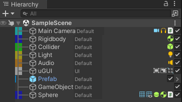

# Portfolio - Grainium
<!-- Mono 12 -->
```
    ▄▄▄▄                          ██                  ██                        
  ██▀▀▀▀█                         ▀▀                  ▀▀                        
 ██         ██▄████   ▄█████▄   ████     ██▄████▄   ████     ██    ██  ████▄██▄ 
 ██  ▄▄▄▄   ██▀       ▀ ▄▄▄██     ██     ██▀   ██     ██     ██    ██  ██ ██ ██ 
 ██  ▀▀██   ██       ▄██▀▀▀██     ██     ██    ██     ██     ██    ██  ██ ██ ██ 
  ██▄▄▄██   ██       ██▄▄▄███  ▄▄▄██▄▄▄  ██    ██  ▄▄▄██▄▄▄  ██▄▄▄███  ██ ██ ██ 
    ▀▀▀▀    ▀▀        ▀▀▀▀ ▀▀  ▀▀▀▀▀▀▀▀  ▀▀    ▀▀  ▀▀▀▀▀▀▀▀   ▀▀▀▀ ▀▀  ▀▀ ▀▀ ▀▀ 
```

## 概要：**開発効率向上**と**開発への低依存性**
Unityエディタ拡張を目的としたライブラリ
モットー：**開発効率向上**と**開発への低依存性**


## 1. 開発のキッカケ
Unityでの開発中、[Alchemy](https://github.com/annulusgames/Alchemy)というライブラリでは痒い所に手が届かないと感じた。  
**特にHierarchyとProjectの機能不足や不具合**が気になったが、作者本人はプルリクエストを求めるだけで修正には消極的だった。  
修正を試みるも構造が複雑で難しく、自分好みの拡張エディタライブラリを一から設計することにした。

## 2. 技術的アプローチ
- IMGUIによる実装。
- Hierarchy・Project拡張を中心に、軽量かつ干渉の少ない仕組みを設計。

## 3. 反省点・改善点
- **UnityTK**を使えば効率的に書けた場面もあったが、内部構造を理解するため敢えて未使用。
- 今後は一部機能をUnityTKベースに置き換えを考え、拡張性を検証したい。

## 4. 得られた学び
- IMGUIのイベント循環とGUIStyle制御を少し理解できた。
- 描画コストや計算コストなどのパフォーマンスチューニングの感覚を知れた。

## 5. 今後の展望
- Hierarchy・Inspectorを統一的に扱えるエディタツールキットを目指す。
- よく使う設計をUtilityやフレームワーク化し、新規OSSとして公開。


<!-- ## 特徴
- **Hierarchy拡張**
  - TreeMap
  - Componentのアイコン表示
  - ToggleによるActive設定
  - 
- **Inspector拡張**
  - Pingボタン
  - Propertiesボタン
- **Project拡張**
  - TreeMap -->


© 2025 OIKAWA Yuki / 5unad0ke1  