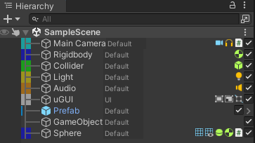
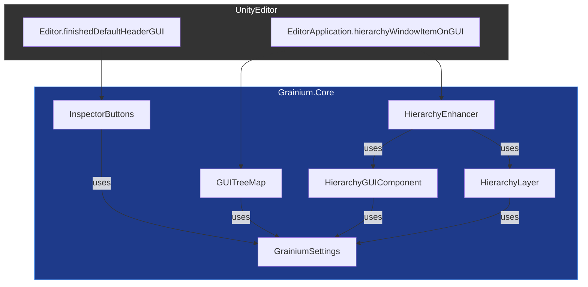
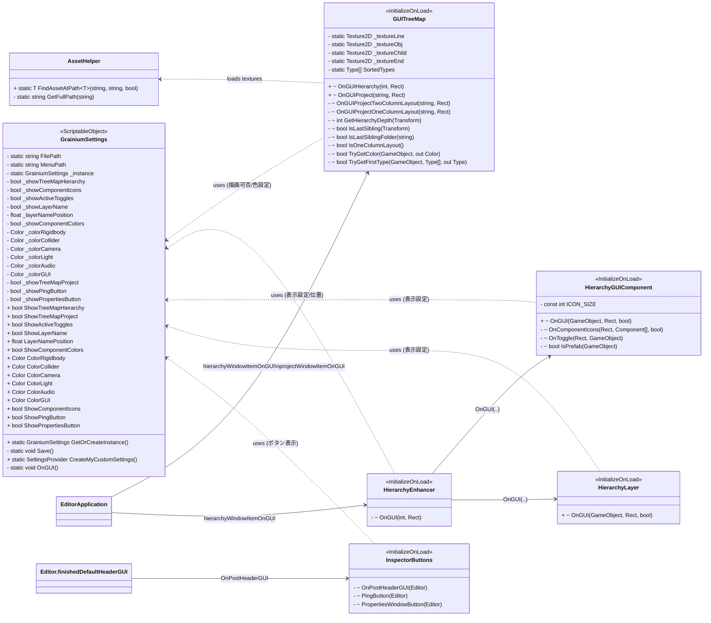
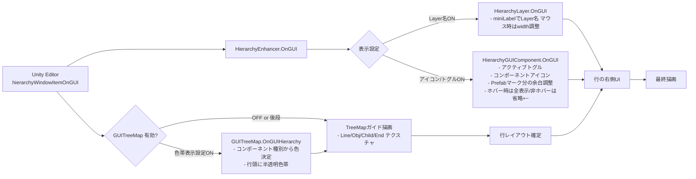
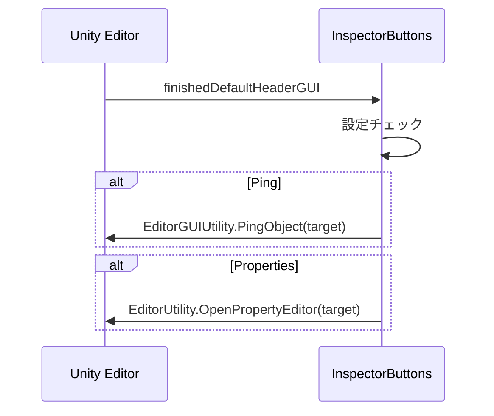

# Portfolio - Grainium

<!-- Mono 12 -->
```
    ▄▄▄▄                          ██                  ██                        
  ██▀▀▀▀█                         ▀▀                  ▀▀                        
 ██         ██▄████   ▄█████▄   ████     ██▄████▄   ████     ██    ██  ████▄██▄ 
 ██  ▄▄▄▄   ██▀       ▀ ▄▄▄██     ██     ██▀   ██     ██     ██    ██  ██ ██ ██ 
 ██  ▀▀██   ██       ▄██▀▀▀██     ██     ██    ██     ██     ██    ██  ██ ██ ██ 
  ██▄▄▄██   ██       ██▄▄▄███  ▄▄▄██▄▄▄  ██    ██  ▄▄▄██▄▄▄  ██▄▄▄███  ██ ██ ██ 
    ▀▀▀▀    ▀▀        ▀▀▀▀ ▀▀  ▀▀▀▀▀▀▀▀  ▀▀    ▀▀  ▀▀▀▀▀▀▀▀   ▀▀▀▀ ▀▀  ▀▀ ▀▀ ▀▀ 
```
Grainium — “Minimal yet Flexible Editor Framework for Unity”

Hierarchy・Project・Inspectorを統一的・低依存的に拡張できるツールキット。
Unity Editor拡張の「**扱いやすさと分かりやすさの両立**」を追求した。



---

# #1 開発のキッカケ

## 問題

既存の[Alchemy](https://github.com/annulusgames/Alchemy)では、拡張時に以下の問題があった：
- PrefabのGameObjectでのボタンの干渉
- コンポーネントアイコンにTransformも表示され、視認性が悪い
- アンインストール後に不具合が発生

## 解決

**Grainiumでは**「干渉の少ない構造」と「処理の明確化」を目標に、
``EditorApplication.hierarchyWindowItemOnGUI()``等の既存イベントを活用し、
IMGUIをベースに**独立性重視**の描画構造を設計。

## 開発理由

[Alchemy](https://github.com/annulusgames/Alchemy)の作者本人はプルリクエストを求めるだけで修正には消極的だった。  
修正を試みるも構造が複雑で難しく、自分好みの拡張エディタライブラリを一から設計することにした。

# #2 技術的アプローチ

## 設計思想：
- 外部依存を減らし、リフレクションを最小限化
- IMGUIイベントの明確なフロー分離
- 「拡張ポイント」を明示化して他ツールと競合しにくくする

## 設計


この構造により、他ツールとの競合を防ぎつつ、拡張点を明示化できる

---

### 描画


---

### クラス図



---

### Hierarchy拡張



---
### Inspectorボタン拡張


## 実装例

```cs
// Transform階層の深さを再帰なしで算出
private static int GetHierarchyDepth(Transform t)
{
    int depth = 0;
    while (t.parent != null)
    {
        depth++;
        t = t.parent;
    }
    return depth;
}
```

```cs
// Projectウィンドウのレイアウト（1列/2列）を判定
private static bool IsOneColumnLayout()
{
    var type = typeof(Editor).Assembly.GetType("UnityEditor.ProjectBrowser");
    var windows = Resources.FindObjectsOfTypeAll(type);
    if (windows.Length == 0) return true;

    var field = type.GetField("m_ViewMode", BindingFlags.Instance | BindingFlags.NonPublic);
    int viewMode = (int)field.GetValue(windows[0]);
    return viewMode == 0;
}
```

```cs
// Inspector上部にPing/Propertiesボタンを追加
 [InitializeOnLoad]
 internal static class InspectorButtons
 {
     static InspectorButtons()
     {
         Editor.finishedDefaultHeaderGUI += OnPostHeaderGUI;
     }
     private static void OnPostHeaderGUI(Editor editor)
     {
         GUILayout.BeginHorizontal();
         GUILayout.FlexibleSpace();

         if(GrainiumSettings.GetOrCreateInstance().ShowPingButton)
             PingButton(editor);
         if (GrainiumSettings.GetOrCreateInstance().ShowPropertiesButton)
             PropertiesWindowButton(editor);

         GUILayout.EndHorizontal();
     }
     private static void PingButton(Editor editor)
     {
         if (GUILayout.Button("Ping", GUILayout.Width(120)))
         {
             EditorGUIUtility.PingObject(editor.target);
         }
     }
     private static void PropertiesWindowButton(Editor editor)
     {
         if (GUILayout.Button("Properties", GUILayout.Width(120)))
         {
             EditorUtility.OpenPropertyEditor(editor.target);
         }
     }
 }
```
# #3 学び・改善点

- 改善点
  - GUIStyleの再利用によるGC削減
  - 今後は一部機能をUnityTKベースに置き換えによる、拡張性の向上。
- 学び
  - Event.current.typeの判定順序を理解したことで、Layout→Repaint間のState同期が安定した
  - IMGUIのイベント循環とGUIStyle制御を理解した。
  - 描画コストや計算コストなどのパフォーマンスチューニングの感覚を知れた。

# #4 今後の展望

- UIElement対応版の試作
- Hierarchy・Inspectorを統一的に扱えるエディタツールキットを目指す。
- よく使う設計をUtilityやフレームワーク化し、新規OSSとして公開。


© 2025 OIKAWA Yuki / 5unad0ke1 
GitHub: github.com/5unad0ke1