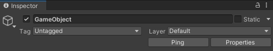

# Grainium

[](LICENSE)

[日本語](README_JA.md) | English

Provides editor extensions for Unity's Inspector, Hierarchy, and Project views.




# Installation

## Via Package Manager
1. Open Unity Package Manager
2. Click `+` → `add package from git URL...`
3. Enter the following URL:

```
https://github.com/5unad0ke1/Grainium.git?path=/Grainium/Assets/Grainium
```

# Support

Please report issues or provide feedback on the [GitHub repository](https://github.com/5unad0ke1/Grainium).

# License

[MIT License](LICENSE)